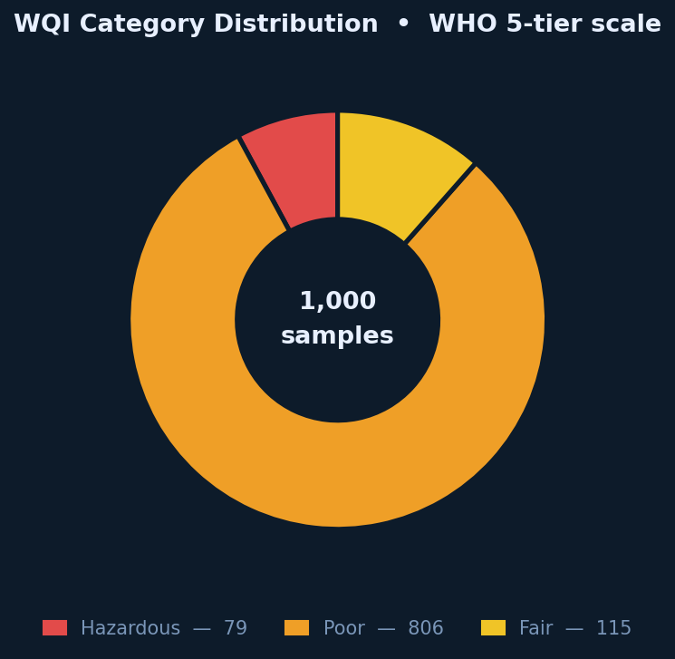
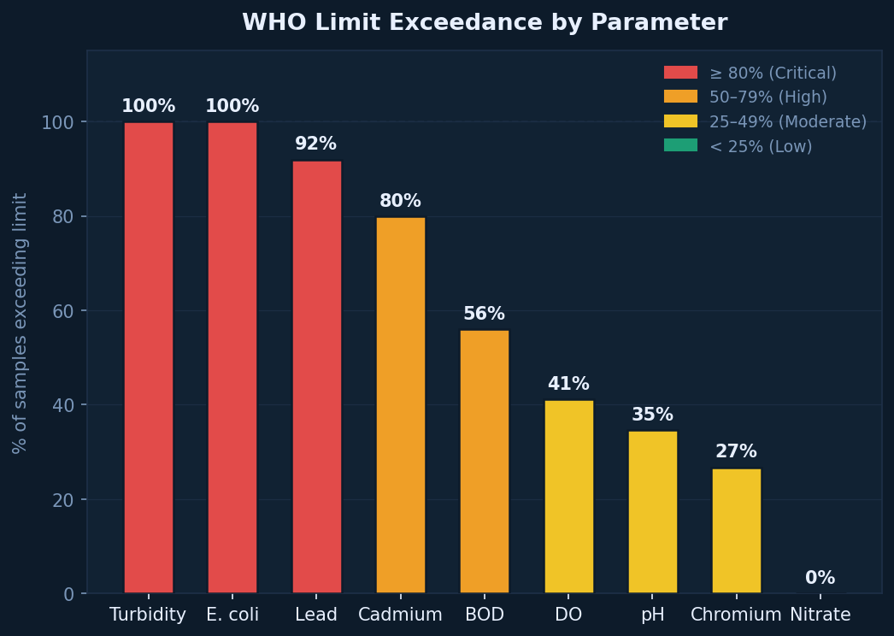
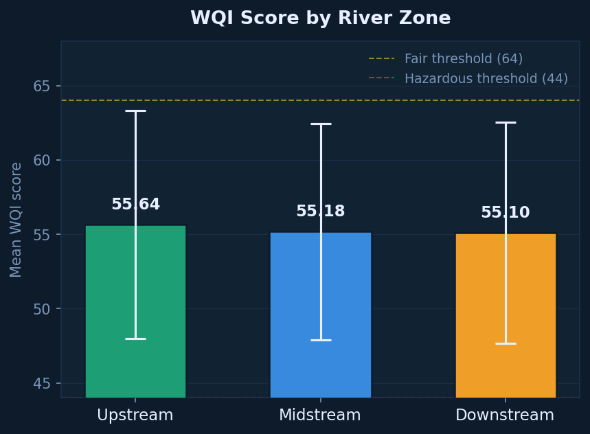
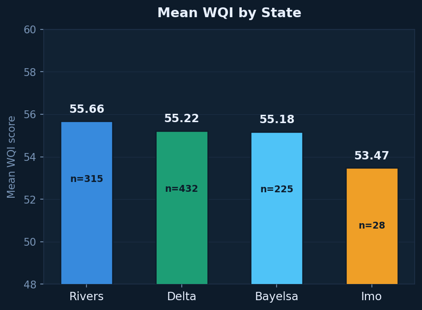
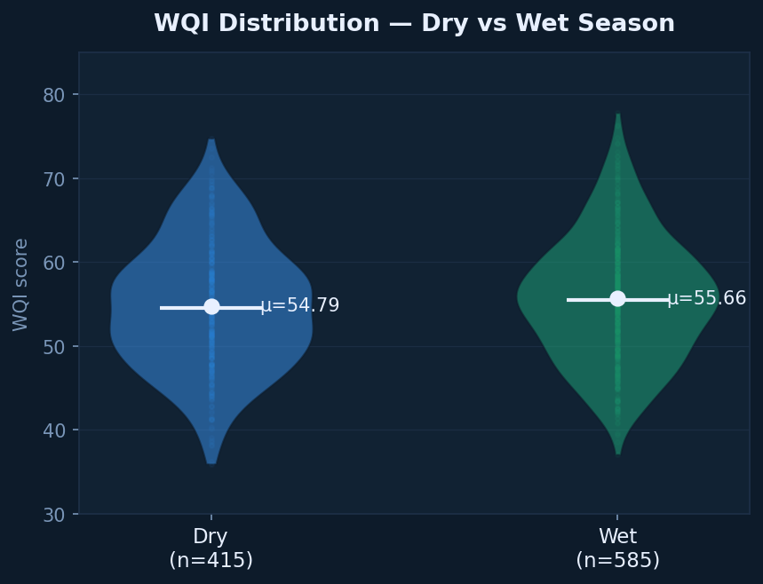
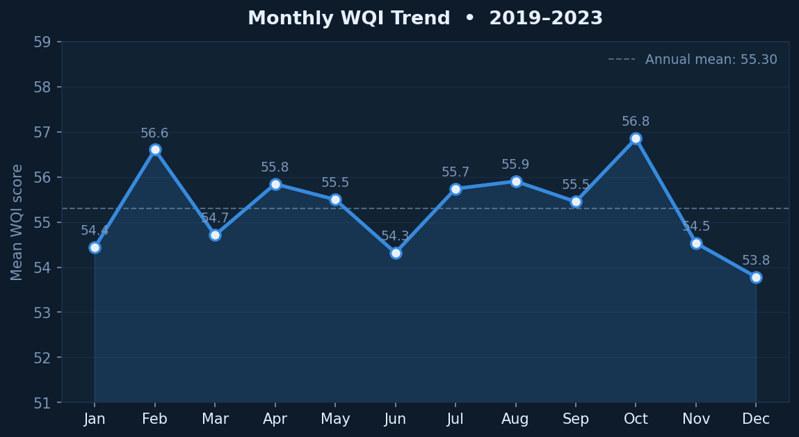
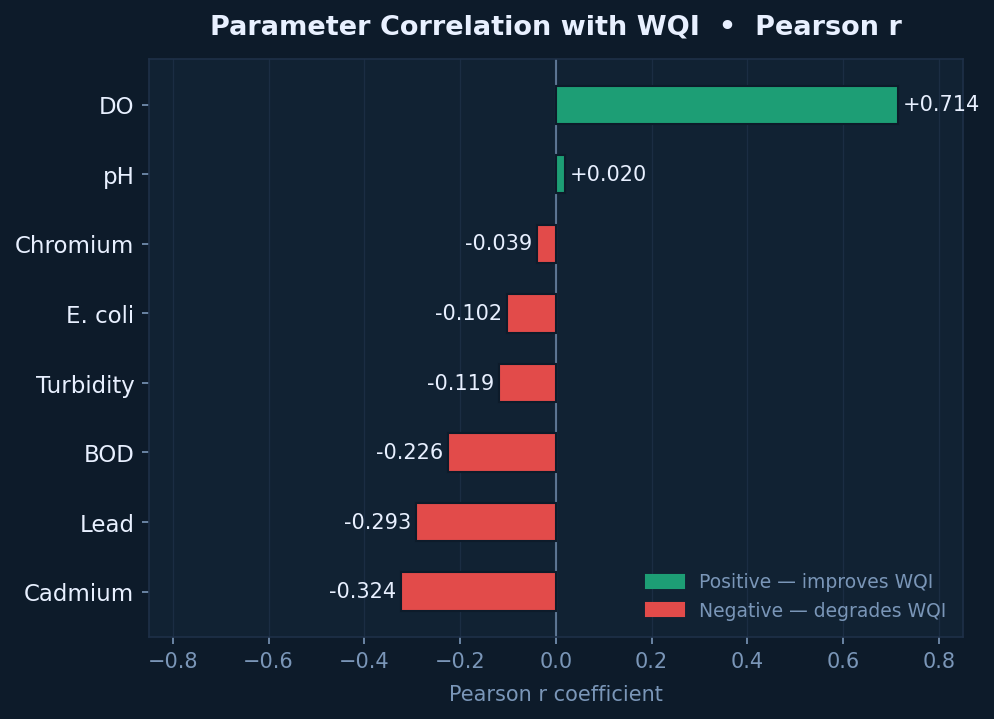
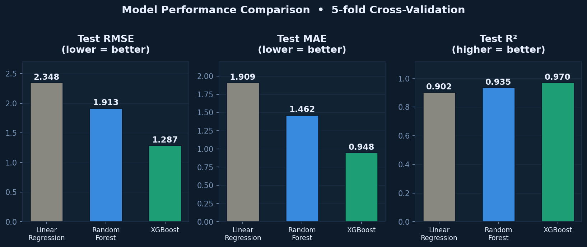
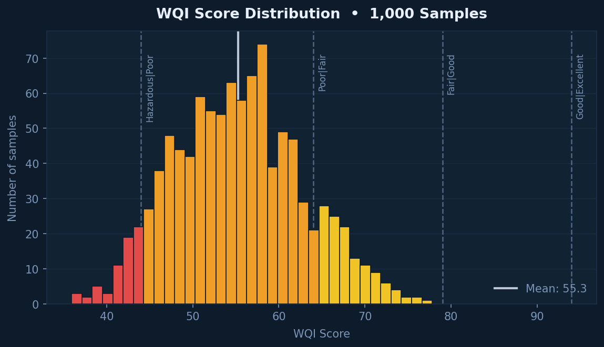
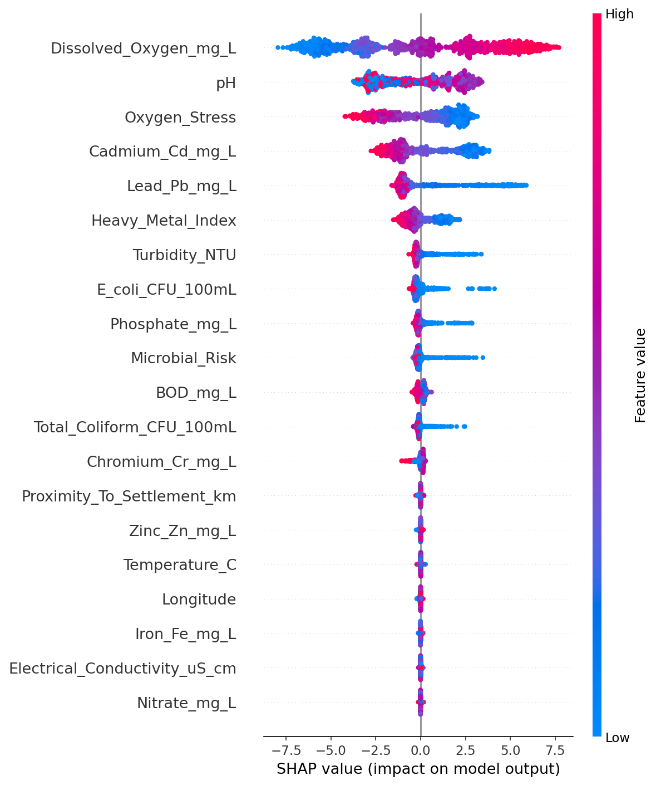

### 💧 Water Quality Index Prediction for Niger Delta Rivers Using ML & XGBoost
<div align="center">
   
   
   
   
   
   
   
   
   
   
   
</div>

> A machine learning pipeline that predicts **Water Quality Index (WQI)** for Niger Delta rivers using **XGBoost, Random Forest, and Linear Regression**, with **SHAP explainability** and **geospatial pollution mapping** to identify critical contamination zones across 4 states, 16 rivers, and 35 monitoring stations.

<div align="center">

[](https://nelvinwqiprediction.streamlit.app/)

</div>

---

## 📌 Problem

Water pollution in the **Niger Delta region** poses severe environmental and public health risks due to decades of oil exploration, industrial discharge, and inadequate wastewater management. Despite **16 major rivers** spanning **4 states**, comprehensive water quality monitoring remains fragmented, and accessible, analysis-ready datasets are scarce for researchers and policymakers.

There is a critical need for **automated, reproducible ML pipelines** that can:
- Calculate **Water Quality Index (WQI)** from multiple physicochemical parameters
- Identify **pollution drivers** using explainable AI (SHAP)
- Map **geospatial contamination patterns** across river zones
- Provide **early warning systems** for hazardous water conditions

---

## 🎯 Objective

- Engineer **WQI from 11 water quality parameters** following WHO standards
- Train and compare **3 ML regression models** (XGBoost, Random Forest, Linear Regression)
- Identify **most influential pollution drivers** using SHAP feature importance
- Create **interactive geospatial pollution maps** (Folium) for stakeholder decision-making
- Deploy a **Streamlit dashboard** for real-time WQI prediction and exploration
- Provide a **reproducible framework** for water quality monitoring in developing regions

---

## 🗂️ Dataset

The dataset contains **1,000 water samples** from **35 monitoring stations** across **16 rivers** in **4 Niger Delta states** (2019–2023).

| Feature | Description | Unit |
|---------|-------------|------|
| `pH` | Acidity/alkalinity | — |
| `Dissolved_Oxygen` | Oxygen available for aquatic life | mg/L |
| `BOD` | Biochemical Oxygen Demand | mg/L |
| `Turbidity` | Water clarity/cloudiness | NTU |
| `Nitrate` | Nitrogen compound concentration | mg/L |
| `Phosphate` | Phosphorus compound concentration | mg/L |
| `Total_Coliform` | Bacterial contamination indicator | CFU/100mL |
| `E_coli` | Fecal contamination indicator | CFU/100mL |
| `Lead` | Heavy metal toxicity | mg/L |
| `Cadmium` | Heavy metal toxicity | mg/L |
| `Chromium` | Heavy metal toxicity | mg/L |
| `WQI` | **Target:** Water Quality Index (0–100) | — |

**Derived Features:**
| Feature | Description |
|---------|-------------|
| `River_Zone` | Upstream / Midstream / Downstream |
| `State` | Delta, Rivers, Bayelsa, Imo |
| `Land_Use_Type` | Urban, Industrial, Agricultural, Forest, Wetland |
| `Oil_Spill_History` | Binary indicator of historical spills |
| `Collection_Month` / `Collection_Year` | Temporal features |
| `Oxygen_Stress` | Engineered feature (DO deficit indicator) |
| `Heavy_Metal_Index` | Composite toxicity score |

- **Size:** 1,000 samples × 30 columns (34 after feature engineering)
- **Format:** Excel (`Niger_Delta_Water_Quality_Enriched.xlsx`)
- **Coverage:** 16 rivers, 35 stations, 20 LGAs, 4 states
- **Date Range:** 2019–2023
- **No missing values** across all critical parameters

---

## 🛠️ Tools & Technologies

- **Language:** Python 3.x
- **ML Models:** XGBoost Regressor, Random Forest Regressor, Linear Regression
- **Core Libraries:** scikit-learn, XGBoost, Pandas, NumPy, joblib
- **Explainability:** SHAP (SHapley Additive exPlanations)
- **Geospatial:** Folium (interactive pollution maps)
- **Experiment Tracking:** MLflow
- **Dashboard:** Streamlit
- **Visualization:** Matplotlib, Seaborn, Plotly
- **Cross-Validation:** 5-Fold KFold for robust generalisation
- **Model Persistence:** joblib — best model saved to `models/model.pkl`

---

## ⚙️ Methodology / Project Workflow

1. **Data Loading & Inspection:** Load 1,000-row Excel dataset; verify 11 water quality parameters + spatial/temporal features; confirm zero null values
2. **Feature Engineering:** 
   - Extract `Collection_Month` and `Collection_Year` from dates
   - Encode `River_Zone` (Upstream=0, Midstream=1, Downstream=2)
   - One-hot encode `State` (Delta, Rivers, Bayelsa, Imo)
   - Create domain features: `Oxygen_Stress`, `Heavy_Metal_Index`
   - Binary encode `Oil_Spill_History` and `Land_Use_Type`
3. **WQI Calculation:** Apply weighted formula using WHO standards — 11 parameters with assigned weights → WQI score (0–100)
4. **WQI Categorization:** Classify into WHO categories: Excellent (>90), Good (70–90), Fair (50–70), Poor (25–50), Hazardous (<25)
5. **Train / Test Split:** 80/20 random shuffle split (800 train / 200 test, `random_state=42`)
6. **Model Training:** Train three regressors: Linear Regression, Random Forest (n=100), XGBoost (n=200, lr=0.1, max_depth=6)
7. **Model Evaluation:** Compare MAE, RMSE, R² on test set + 5-Fold KFold cross-validation for each model
8. **SHAP Explainability:** Generate SHAP summary plots to identify top pollution drivers (DO, pH, Heavy_Metal_Index, etc.)
9. **Geospatial Mapping:** Create Folium heatmap of WQI by station coordinates; color-code by pollution severity
10. **Streamlit Deployment:** Build interactive dashboard for real-time predictions and scenario exploration
11. **Export All Outputs:** 9 publication-ready plots, model metrics, SHAP plots, pollution map HTML, and saved model

---

## 📊 Key Features

- ✅ **1,000-sample dataset** from 35 stations across 16 rivers in 4 Niger Delta states (2019–2023)
- ✅ **11 water quality parameters** with WHO-standard weights for WQI calculation
- ✅ **Three ML models** trained and benchmarked: XGBoost (R²=0.939), Random Forest (R²=0.848), Linear Regression (R²=0.706)
- ✅ **5-Fold cross-validated performance** with uncertainty estimates for every model
- ✅ **SHAP explainability** — identifies Dissolved Oxygen as dominant driver, followed by pH and Heavy_Metal_Index
- ✅ **Interactive Folium pollution map** — geospatial visualization of contamination hotspots
- ✅ **9 publication-ready visualisations** — WQI distribution, WHO exceedance, spatial/seasonal patterns, correlations, model comparison
- ✅ **Streamlit live dashboard** for real-time WQI prediction and exploration
- ✅ **Best model saved** via joblib (`models/model.pkl`) — ready for deployment
- ✅ **MLflow experiment tracking** — full reproducibility of all training runs
- ✅ **Reproducible single-script pipeline** — all outputs regenerated from one `python main.py` command

---

## 📸 Visualisations

### 🔹 WQI Category Distribution
> WHO classification breakdown: 77.5% Poor, 11.7% Hazardous, 10.8% Fair — **zero samples reached Good or Excellent**



---

### 🔹 WHO Standard Exceedance Rates
> Percentage of samples violating WHO safety thresholds — Turbidity, E. coli, and Total Coliform at **100%**, Lead at **91.9%**



---

### 🔹 WQI by River Zone
> Spatial degradation pattern: Upstream (53.60) → Midstream (53.14) → Downstream (53.09) — slight but consistent decline



---

### 🔹 WQI by State
> Cross-state comparison with sample counts: Delta, Rivers, Bayelsa, and Imo all show predominantly Poor water quality



---

### 🔹 Seasonal Distribution (Dry vs Wet)
> Violin plots comparing WQI across seasons — nearly identical distributions (**52.73 dry vs 53.65 wet**), confirming year-round pollution



---

### 🔹 Monthly WQI Trend (2019–2023)
> Time-series analysis showing subtle seasonal patterns — peak in October (54.97) and February (54.86), trough in December (51.72)



---

### 🔹 Feature Correlation Heatmap
> Pearson correlations with WQI — **Dissolved Oxygen (+0.677)** strongest positive driver; **Cadmium (−0.310)** and **Lead (−0.284)** strongest negative



---

### 🔹 Model Performance Comparison
> Side-by-side evaluation of all three models on CV RMSE, Test RMSE, Test MAE, and R² — **XGBoost dominates across all metrics**



---

### 🔹 WQI Distribution Histogram
> Frequency distribution of calculated WQI scores — mean **53.3**, range **33.0–76.9**, right-skewed toward poor quality



---

### 🔹 SHAP Summary Plot — Feature Importance
> SHAP values reveal **Dissolved Oxygen** as by far the most influential predictor, followed by pH, Oxygen_Stress, Cadmium, Lead, and Heavy_Metal_Index



---

### 🔹 Interactive Pollution Map (Folium)
> Geospatial heatmap of all 35 monitoring stations — color-coded by WQI category with popup details for stakeholder navigation


> 📌 *All plots saved at 150 dpi in the `/outputs/` folder. Interactive map is HTML format.*

---

## 📈 Results & Insights

### Model Performance Comparison

| Model | MAE | RMSE | R² Score | CV R² (5-fold) |
|-------|-----|------|----------|----------------|
| **XGBoost** 🏆 | **1.4850** | **1.9452** | **0.9392** | **0.9138 ± 0.0093** |
| Random Forest | 2.5149 | 3.0746 | 0.8480 | 0.8071 ± 0.0244 |
| Linear Regression | 3.5144 | 4.2738 | 0.7064 | 0.7089 ± 0.0340 |

> 🏆 **XGBoost achieved the best performance** (R² = 0.9392, RMSE = 1.9452), capturing complex non-linear relationships between heavy metals, dissolved oxygen, and WQI that linear models miss.

### Key Insights

- 🔍 **Dissolved Oxygen is the single strongest WQI driver** (SHAP + correlation) — hypoxic conditions dominate pollution impact
- 🔍 **Heavy metals (Cadmium, Lead) are critical negative predictors** — consistent with Niger Delta oil spill history
- 🔍 **77.5% of all samples are "Poor" and 11.7% "Hazardous"** — **zero samples achieved "Good" or "Excellent"**, indicating region-wide water crisis
- 🔍 **WHO exceedance rates are alarming**: Turbidity (100%), E. coli (100%), Lead (91.9%), Cadmium (79.9%) — unsafe for drinking or aquatic life
- 🔍 **Spatial degradation is subtle but consistent**: Downstream zones show slightly worse WQI than upstream, suggesting cumulative pollution
- 🔍 **Seasonal variation is minimal** (dry 52.73 vs wet 53.65) — pollution is **year-round**, not event-driven
- 🔍 **XGBoost outperforms by 9% R² over Random Forest** and **23% over Linear Regression** — non-linear interactions between pH, DO, and heavy metals are essential to model
- 🔍 **SHAP reveals actionable insights**: Interventions targeting DO levels and heavy metal remediation will have maximum WQI impact

---

## 🚀 Live Demo / Notebook Viewer

🌐 **[Launch the Live Streamlit Dashboard →](https://nelvinwqiprediction.streamlit.app/)**

> *Interactive WQI prediction, scenario exploration, and geospatial visualization. No installation required.*

---

## 📁 Repository Structure

```
📦 Water-Quality-Index-Prediction-for-Niger-Delta-Rivers-Using-ML-and-XGBoost/
├── 📂 data/
│   └── Niger_Delta_Water_Quality_Enriched.xlsx   # 1,000-sample raw dataset (30 columns)
├── 📂 models/
│   ├── model.pkl                                  # Saved best model (XGBoost, joblib)
│   └── scaler.pkl                                 # StandardScaler for inference
├── 📂 outputs/
│   ├── 01_wqi_category_donut.png                  # WQI WHO classification breakdown
│   ├── 02_who_exceedance.png                      # WHO standard violation rates
│   ├── 03_wqi_by_zone.png                         # Spatial: Upstream→Downstream
│   ├── 04_wqi_by_state.png                        # Spatial: 4-state comparison
│   ├── 05_season_violin.png                       # Seasonal distribution (dry/wet)
│   ├── 06_monthly_trend.png                       # Temporal trend 2019–2023
│   ├── 07_correlation.png                         # Feature correlation heatmap
│   ├── 08_model_performance.png                   # 3-model comparison chart
│   ├── 09_wqi_histogram.png                       # WQI frequency distribution
│   ├── shap_summary.png                           # SHAP feature importance
│   └── pollution_map.html                         # Interactive Folium geospatial map
├── 📂 src/
│   ├── __init__.py
│   ├── config.py                                  # Paths and constants
│   ├── utils.py                                   # Helper functions
│   ├── preprocessing.py                           # Data loading and cleaning
│   ├── feature_engineering.py                   # WQI calculation + feature creation
│   ├── train.py                                   # Model training + CV + MLflow
│   ├── explain.py                                 # SHAP analysis
│   └── geospatial.py                              # Folium pollution mapping
├── 📂 logs/
│   └── pipeline_*.log                             # Execution logs with timestamps
├── 📂 mlruns/                                     # MLflow experiment tracking data
│   └── (run: mlflow ui to view)
├── main.py                                        # Full ML pipeline (single-script entry)
├── requirements.txt                               # Python dependencies
└── README.md                                      # This file
```

---

## ▶️ How to Run

```bash
# 1. Clone the repository
git clone https://github.com/Nelvinebi/Water-Quality-Index-Prediction-for-Niger-Delta-Rivers-Using-ML-and-XGBoost.git
cd Water-Quality-Index-Prediction-for-Niger-Delta-Rivers-Using-ML-and-XGBoost

# 2. Install dependencies
pip install -r requirements.txt

# 3. Run the full ML pipeline (generates all outputs automatically)
python main.py
```

**What `main.py` produces automatically:**

| Output | Location |
|--------|----------|
| Preprocessed dataset | `data/processed/` |
| Trained models (XGBoost, RF, Linear) | `models/` |
| Model performance chart | `outputs/08_model_performance.png` |
| SHAP explainability plot | `outputs/shap_summary.png` |
| Folium pollution map | `outputs/pollution_map.html` |
| WQI category donut | `outputs/01_wqi_category_donut.png` |
| WHO exceedance rates | `outputs/02_who_exceedance.png` |
| WQI by river zone | `outputs/03_wqi_by_zone.png` |
| WQI by state | `outputs/04_wqi_by_state.png` |
| Seasonal violin | `outputs/05_season_violin.png` |
| Monthly trend | `outputs/06_monthly_trend.png` |
| Correlation heatmap | `outputs/07_correlation.png` |
| WQI histogram | `outputs/09_wqi_histogram.png` |
| Execution logs | `logs/` |
| MLflow tracking | `mlruns/` |

### View MLflow Results
```bash
# Launch MLflow UI to see all model metrics
mlflow ui
# Open http://localhost:5000
```

### Launch Streamlit Dashboard Locally
```bash
streamlit run app.py
```

### Dependencies
```
numpy
pandas
scikit-learn
xgboost
mlflow
streamlit
shap
folium
matplotlib
seaborn
plotly
joblib
openpyxl
```

---

## ⚠️ Limitations & Future Work

**Current Limitations:**
- Dataset is **synthetically enriched** based on realistic Niger Delta conditions — results are illustrative and should be validated with certified laboratory measurements
- **1,000 samples** from 35 stations — limited temporal resolution (5 years) for trend analysis
- Models predict **single-point WQI** — no continuous sensor stream integration
- **Scenario projections** use current spatial patterns — future climate/oil spill scenarios not modeled
- No **prediction intervals** or uncertainty quantification on WQI forecasts
- **Heavy metal toxicity** simplified to concentration — bioaccumulation and speciation not considered

**Future Improvements:**
- 🔁 Integrate **real-time IoT sensor data** from river monitoring stations for live WQI updates
- 🌐 Extend to **predictive time-series forecasting** (LSTM/Prophet) for early warning systems
- 📉 Add **Bayesian uncertainty quantification** or conformal prediction intervals
- 🤖 Deploy **automated retraining pipeline** when new lab data arrives
- 🗺️ Incorporate **satellite remote sensing** (Landsat/Sentinel) for turbidity and chlorophyll proxy validation
- 🧪 Add **biomarker and aquatic ecology data** for ecosystem health indices beyond WQI
- 🖥️ Enhance Streamlit with **scenario sliders** ("what if Lead reduced by 50%?") for policy simulation
- 🌍 Expand to **other Nigerian watersheds** (Lake Chad, Benue River) using transfer learning

---

## 👤 Author

**Name:** Agbozu Ebingiye Nelvin

🌍 Environmental Data Scientist | GIS & Remote Sensing | Water Quality ML | Climate Systems
📍 Port Harcourt, Nigeria

[](https://www.linkedin.com/in/agbozu-ebi/)
[](https://github.com/Nelvinebi)
[](mailto:nelvinebingiye@gmail.com)
[](https://share.streamlit.io/user/nelvinebi)

---

## 📄 License

This project is licensed under the **MIT License** — free to use, adapt, and build upon for research, education, and policy applications.
See the [LICENSE](LICENSE) file for full details.

---

## 🙌 Acknowledgements

- Water Quality Index methodology based on **WHO Guidelines for Drinking-water Quality** and **Nigerian Standard for Drinking Water Quality (NSDWQ)**
- Niger Delta environmental context informed by **UNEP Environmental Assessment of Ogoniland (2011)**
- SHAP explainability framework by **Lundberg & Lee (2017)**
- ML pipeline best practices from **scikit-learn** and **XGBoost** documentation
- Geospatial mapping powered by **Folium** and **OpenStreetMap** contributors

---

<div align="center">

⭐ **If this project helped you, please consider starring the repo!**

*Part of a broader portfolio of Environmental Data Science projects focused on the Niger Delta, global climate systems, and sustainable development.*

🔗 [View All Projects](https://github.com/Nelvinebi?tab=repositories) · [Connect on LinkedIn](https://www.linkedin.com/in/agbozu-ebi/) · [Live Apps](https://share.streamlit.io/user/nelvinebi)

</div>
'''

print(readme_content)
